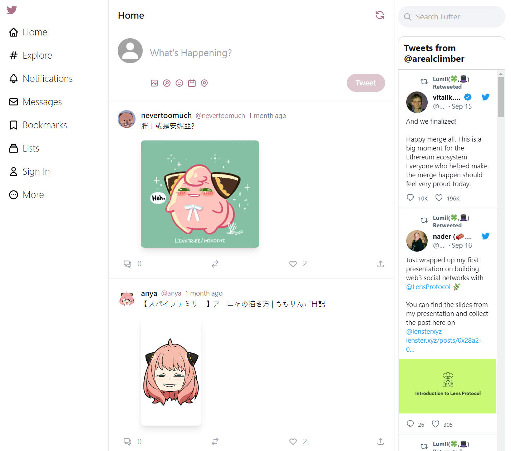

# Introduction

It's a Twitter clone project.

### Features:

- [x] Tweet with image URL
- [x] Comment as a thread
- [x] Ban malicious users
- [x] Sign in with Twitter
- [x] Responsive Website Design
- [ ] Dark mode toggle
- [ ] Web3 login
- [ ] Make tweet on-chain NFT

### Project preview

# Tech Stacks

- Typescript
- Next.js
  - next-sanity
  - next-auth
  - react-hot-toast
- Tailwind CSS
- CMS (Sanity)
- Twitter API
